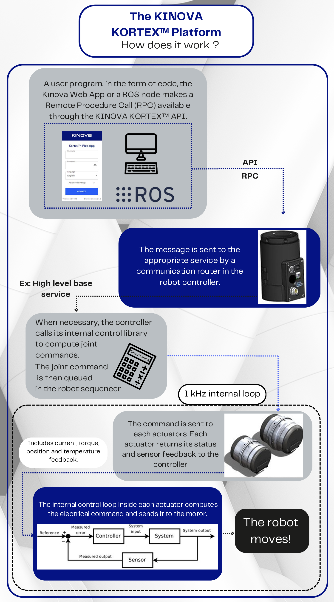
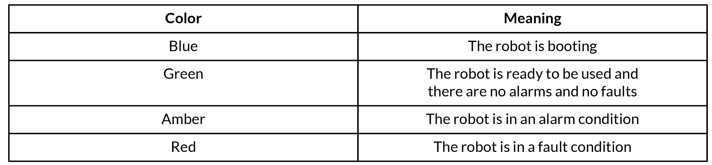
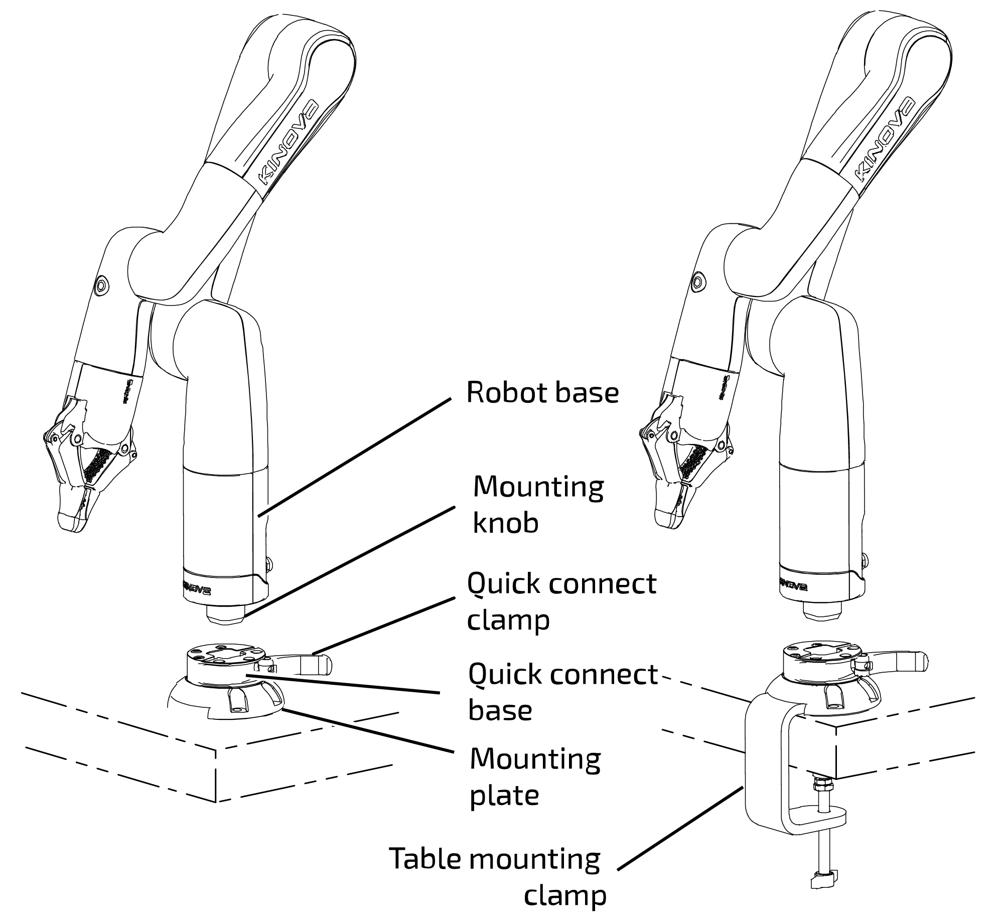

# Kinova Gen3 Lite Python

A python wrapper to interact with Kinova Gen3 Lite in the simplest way possible.

This wrapper is built based on the official [Kinova Kortex2 API](https://github.com/Kinovarobotics/Kinova-kortex2_Gen3_G3L).

The official repository contains documentation and examples explaining how to use the Kortex Python.

## Instructions

### Prerequisites
- Download and install the latest Kortex API from the [official repository](https://github.com/Kinovarobotics/Kinova-kortex2_Gen3_G3L#download-links).
- Ensure your Gen3 Lite has the latest firmware version according to the table.
- Follow the installation instructions provided in the Kortex documentation.

### Connect to the robot
- Connect the robot to a USB port as outlined in the [official guide](chrome-extension://efaidnbmnnnibpcajpcglclefindmkaj/https://static.generation-robots.com/media/Kinova-lite-fiche-technique.pdf).

### Launch connection scripts
- Try launching [the connection script](wrappers/simple_connection.py).
- Make sure to use the correct IP and Port settings.
- Double check the username and password.

## About Kinova Kortex

## Good to know
The LED on the robot can signal the current status of the firmware.

The robot's different mounting components.

